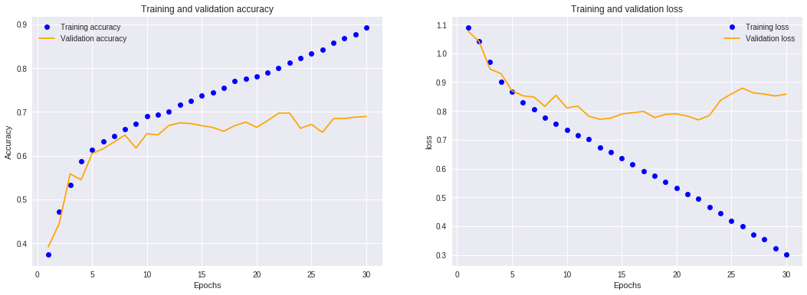

### (in progress)

## Introduction

In this project I resolve image-classification problem of detecting age class (young, middle or old) based on person's face images. I use convolutional neural networks, which is well-proven approach in deep learning to work with image datasets.
I intentionally decided to work on small training dataset, which is common real-world project use case.

All needed theoretical knowledge about Convolutional Neural Networks to fully understand each step in the project is covered in this [Andrew Ng course on Coursera](https://www.coursera.org/learn/convolutional-neural-networks/home/welcome). I also recommend chapter 5 in book [Deep Learning with Python by François Chollet](https://www.manning.com/books/deep-learning-with-python), which helped me to complete this project.  

### Dataset description

Indian Movie Face database (IMFDB) is a large unconstrained face database consisting of 34512 images of 100 Indian actors collected from more than 100 videos. All the images are manually selected and cropped from the video frames resulting in a high degree of variability interms of scale, pose, expression, illumination, age, resolution, occlusion, and makeup. IMFDB is the first face database that provides a detailed annotation of every image in terms of age, pose, gender, expression and type of occlusion that may help other face related applications. For more information and link to download can be found [here](http://cvit.iiit.ac.in/projects/IMFDB/). 


## Project Plan:
---
- Narrow data to small dataset size and organize file structure.
- Image preprocessing with Keras ImageDataGenerator.
- Build CNN baseline model.
- Include some regularization techniques.
- Use Data augmentation to mitigate overfitting.
- Use some well-known convolutional networks with weights pre-trained on ImageNet to build model with higher performance. 
- Fine-tuning weights in a few top layers network.
- Conclusions


## Steps:


### Narrow data to small dataset size and organize file structure. 


For simplicity I dataset is downloaded from [datahack.analyticsvidhya.com](https://datahack.analyticsvidhya.com/contest/practice-problem-age-detection/). The labels has been already converted to a multiclass problem with classes as Young, Middle and Old.

Since I will use [`ImageDataGenerator.flow_from_directory()`](https://keras.io/preprocessing/image/) to preprocess data, it expects data to be organized in following directiories and subdirectories.  


```
train_young_dir = os.path.join(train_dir, 'young')
os.mkdir(train_young_dir)

validation_young_dir = os.path.join(validation_dir, 'young')
os.mkdir(validation_young_dir)
```


Then I narrow available data to small dataset size by random sampling. 

```
# Young class

labels_young = labels.loc[labels.Class == 'YOUNG']
labels_young = labels_young.sample(frac=1)

for i, row in labels_young.iloc[:1600].iterrows():
    src = os.path.join(train_all, row.ID)
    dst = os.path.join(train_young_dir, row.ID)
    shutil.copy(src, dst)
    
for i, row in labels_young.iloc[1600:2400].iterrows():
    src = os.path.join(train_all, row.ID)
    dst = os.path.join(validation_young_dir, row.ID)
    shutil.copy(src, dst)
```

Prepared training and validation dataset:
```
Total training young images: 1600
Total training middle images: 1600
Total training old images: 1600
Total validation young images: 800
Total validation middle images: 800
Total validation old images: 796
```

For full code go to  [data_preparing.ipynb](https://github.com/ksulima/Age_Detection_Convolutional_NN/blob/master/notebooks/data_preparing.ipynb)


### Image preprocessing

Keras ImageDataGenerator automatically turn image files on disk into batches of preprocessed tensors.

Example of Young, Middle and Old observation:

  

Original images varies in width and height. I resize them all to 128x128 width x height and 3 channels (rgb). 

I rescale the pixel values (between 0 and 255) to the [0, 1], as neural networks prefer to deal with small input values.

```
train_datagen = ImageDataGenerator(rescale=1./255) #Rescales all images by 1/255
validation_datagen = ImageDataGenerator(rescale=1./255)
```

```
batch_size = 32
img_size = (128,128,3)

train_generator = train_datagen.flow_from_directory(
                    train_dir, # Target directory
                    target_size=img_size[:2], # Resize all images to 128x128 
                    batch_size=batch_size,
                    color_mode='rgb', 
                    class_mode='categorical')
```
Found 4800 images belonging to 3 classes.

```
validation_generator = validation_datagen.flow_from_directory(
                    validation_dir, # Target directory
                    target_size=img_size[:2], # Resize all images to 128x128 
                    batch_size=batch_size,
                    color_mode='rgb',
                    class_mode='categorical')
```
Found 2396 images belonging to 3 classes.


### Build CNN baseline model

In this step the goal is to set some baseline, what can we achive on the 4800 training samples with small convnet, without any regularization and feature engineering techniques. It should show where we start and what is the potencial for improvement.
 
To figure out what exact architecture to use, I looked over similar image-classification problems.


```
model = models.Sequential()

model.add(layers.Conv2D(32, (3,3), activation='relu', input_shape=img_size) )
model.add(layers.MaxPooling2D((2, 2)))
model.add(layers.Conv2D(64, (3, 3), activation='relu'))
model.add(layers.MaxPooling2D((2, 2)))
model.add(layers.Conv2D(128, (3, 3), activation='relu'))
model.add(layers.MaxPooling2D((2, 2)))
model.add(layers.Conv2D(128, (3, 3), activation='relu'))
model.add(layers.MaxPooling2D((2, 2)))
model.add(layers.Conv2D(128, (3, 3), activation='relu'))
model.add(layers.MaxPooling2D((2, 2)))
model.add(layers.Flatten())
model.add(layers.Dense(512, activation='relu'))
model.add(layers.Dense(3, activation='softmax'))

model.compile(loss='categorical_crossentropy', optimizer=optimizers.RMSprop(lr=1e-4), metrics=['acc'])
```

```
#Fit model
history = model.fit_generator(
          train_generator,
          steps_per_epoch=150,
          epochs=30,
          validation_data=validation_generator,
          validation_steps=75,
          verbose = 1,
          callbacks=[csv_logger])
```




