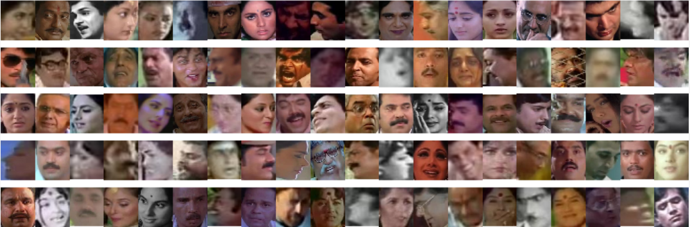

### (in progress)

## Introduction

In this project I resolve image-classification problem of detecting age class (young, middle or old) based on person's face images. I use convolutional neural networks, which is well-proven approach in deep learning to work with image datasets.
I intentionally decided to work on small training dataset, which is common real-world project use case.

All needed theoretical knowledge about Convolutional Neural Networks to fully understand each step in the project is covered in this [Andrew Ng course on Coursera](https://www.coursera.org/learn/convolutional-neural-networks/home/welcome). I also recommend chapter 5 in book [Deep Learning with Python by François Chollet](https://www.manning.com/books/deep-learning-with-python), which helped me to complete this project.  

## Dataset

Indian Movie Face database (IMFDB) is a large unconstrained face database consisting of 34512 images of 100 Indian actors collected from more than 100 videos. All the images are manually selected and cropped from the video frames resulting in a high degree of variability interms of scale, pose, expression, illumination, age, resolution, occlusion, and makeup. IMFDB is the first face database that provides a detailed annotation of every image in terms of age, pose, gender, expression and type of occlusion that may help other face related applications. For more information and link to download can be found [here](http://cvit.iiit.ac.in/projects/IMFDB/). 

## Prepare dataset by sample small dataset size and organize file structure. 

For full code go to [data_preparing.ipynb]()

## Steps:
- Prepare dataset by sample small dataset size and organize file structure. `data_preparing.ipynb`
- Image preprocessing with ImageDataGenerator implemented in Keras.
- Build CNN baseline model
- Include some regularization techniques to model (Dropout and BatchNormalization) 
- Use Data augmentation to mitigate overfitting.
- Use some well-known convolutional networks with weights pre-trained on ImageNet to build model with higher performance. 
- Fine-tuning weights in a few top layers network.
- Conclusions
