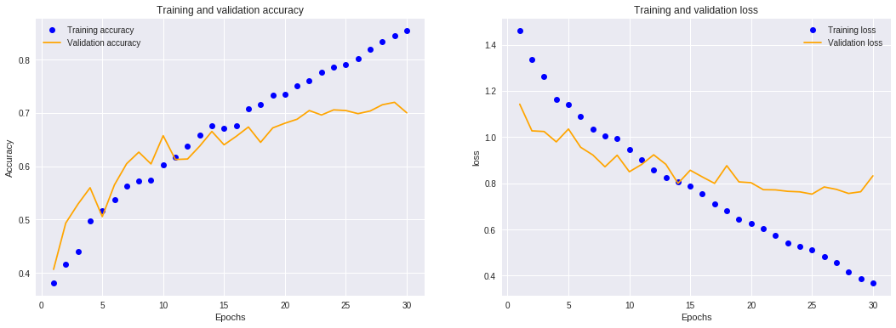
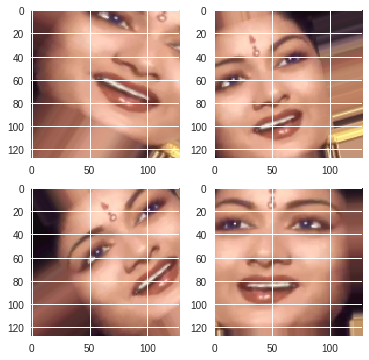
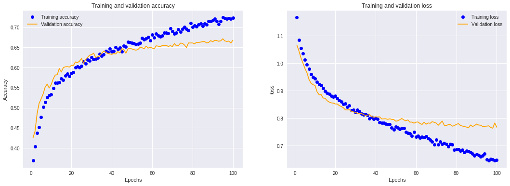

### (in progress)

## Introduction

In this project I resolve image-classification problem of detecting age class (young, middle or old) based on person's face images. I use convolutional neural networks, which is well-proven approach in deep learning to work with image datasets.
I intentionally decided to work on small training dataset, which is common real-world project use case.

All needed theoretical knowledge about Convolutional Neural Networks to fully understand each step in the project is covered in this [Andrew Ng course on Coursera](https://www.coursera.org/learn/convolutional-neural-networks/home/welcome). I also recommend chapter 5 in book [Deep Learning with Python by François Chollet](https://www.manning.com/books/deep-learning-with-python), which helped me to complete this project.  

### Dataset description

Indian Movie Face database (IMFDB) is a large unconstrained face database consisting of 34512 images of 100 Indian actors collected from more than 100 videos. All the images are manually selected and cropped from the video frames resulting in a high degree of variability interms of scale, pose, expression, illumination, age, resolution, occlusion, and makeup. IMFDB is the first face database that provides a detailed annotation of every image in terms of age, pose, gender, expression and type of occlusion that may help other face related applications. For more information and link to download can be found [here](http://cvit.iiit.ac.in/projects/IMFDB/). 


## Project Plan:
---
- Narrow data to small dataset size and organize file structure.
- Image preprocessing with Keras ImageDataGenerator.
- Build CNN baseline model.
- Include some regularization techniques.
- Use Data augmentation to mitigate overfitting.
- Use some well-known convolutional networks with weights pre-trained on ImageNet to build model with higher performance. 
- Fine-tuning weights in a few top layers network.
- Conclusions


## Steps:


### Narrow data to small dataset size and organize file structure. 


For simplicity I dataset is downloaded from [datahack.analyticsvidhya.com](https://datahack.analyticsvidhya.com/contest/practice-problem-age-detection/). The labels has been already converted to a multiclass problem with classes as Young, Middle and Old.

Since I will use [`ImageDataGenerator.flow_from_directory()`](https://keras.io/preprocessing/image/) to preprocess data, it expects data to be organized in following directiories and subdirectories.  


```
train_young_dir = os.path.join(train_dir, 'young')
os.mkdir(train_young_dir)

validation_young_dir = os.path.join(validation_dir, 'young')
os.mkdir(validation_young_dir)
```


Then I narrow available data to small dataset size by random sampling. 

```
# Young class

labels_young = labels.loc[labels.Class == 'YOUNG']
labels_young = labels_young.sample(frac=1)

for i, row in labels_young.iloc[:1600].iterrows():
    src = os.path.join(train_all, row.ID)
    dst = os.path.join(train_young_dir, row.ID)
    shutil.copy(src, dst)
    
for i, row in labels_young.iloc[1600:2400].iterrows():
    src = os.path.join(train_all, row.ID)
    dst = os.path.join(validation_young_dir, row.ID)
    shutil.copy(src, dst)
```

Prepared training and validation dataset:
```
Total training young images: 1600
Total training middle images: 1600
Total training old images: 1600
Total validation young images: 800
Total validation middle images: 800
Total validation old images: 796
```

For full code go to  [data_preparing.ipynb](https://github.com/ksulima/Age_Detection_Convolutional_NN/blob/master/notebooks/data_preparing.ipynb)


### Image preprocessing

Keras ImageDataGenerator automatically turn image files on disk into batches of preprocessed tensors.

Example of Young, Middle and Old observation:

  

Original images varies in width and height. I resize them all to 128x128 width x height and 3 channels (rgb). 

I rescale the pixel values (between 0 and 255) to the [0, 1], as neural networks prefer to deal with small input values.

```
train_datagen = ImageDataGenerator(rescale=1./255) #Rescales all images by 1/255
validation_datagen = ImageDataGenerator(rescale=1./255)
```

```
batch_size = 32
img_size = (128,128,3)

train_generator = train_datagen.flow_from_directory(
                    train_dir, # Target directory
                    target_size=img_size[:2], # Resize all images to 128x128 
                    batch_size=batch_size,
                    color_mode='rgb', 
                    class_mode='categorical')
```
Found 4800 images belonging to 3 classes.

```
validation_generator = validation_datagen.flow_from_directory(
                    validation_dir, # Target directory
                    target_size=img_size[:2], # Resize all images to 128x128 
                    batch_size=batch_size,
                    color_mode='rgb',
                    class_mode='categorical')
```
Found 2396 images belonging to 3 classes.


### Build CNN baseline model

In this step the goal is to set some baseline, what can we achive on the 4800 training samples with small convnet, without any regularization and feature engineering techniques. It should show where we start and what is the potencial for improvement.
 
To figure out what exact architecture to use, I looked over similar image-classification problems.


Model:
```
model = models.Sequential()

model.add(layers.Conv2D(32, (3,3), activation='relu', input_shape=img_size) )
model.add(layers.MaxPooling2D((2, 2)))
model.add(layers.Conv2D(64, (3, 3), activation='relu'))
model.add(layers.MaxPooling2D((2, 2)))
model.add(layers.Conv2D(128, (3, 3), activation='relu'))
model.add(layers.MaxPooling2D((2, 2)))
model.add(layers.Conv2D(128, (3, 3), activation='relu'))
model.add(layers.MaxPooling2D((2, 2)))
model.add(layers.Conv2D(128, (3, 3), activation='relu'))
model.add(layers.MaxPooling2D((2, 2)))
model.add(layers.Flatten())
model.add(layers.Dense(512, activation='relu'))
model.add(layers.Dense(3, activation='softmax'))

model.compile(loss='categorical_crossentropy', optimizer=optimizers.RMSprop(lr=1e-4), metrics=['acc'])
```

Fit model:
```
history = model.fit_generator(
          train_generator,
          steps_per_epoch=150,
          epochs=30,
          validation_data=validation_generator,
          validation_steps=75,
          verbose = 1,
          callbacks=[csv_logger])
```


Results:


We reach about 68% accuracy on validation set - not so bad for the beginning. Training accuracy reaches 90% and it increases linearly with epochs. The validation loss reaches its minimum at 13 epoch.

Main insights:
 - we have overfitting issue. While training, model starts to overfit after 12 epochs.
 - we could probably fit model to almost 100% training accuracy. Baseline model architecture is sufficiently complex, model can grasp all nuances in training data - that's good.
 
 
 ### Include some regularization techniques
 
 Let's include two regularization techniques to the baseline model, Dropout and Batch Normalization.
 
 
 Model:
 ```
 model = models.Sequential()

  model.add( layers.Conv2D(32, (3,3), activation='relu', input_shape=img_size) )
  model.add(layers.BatchNormalization(axis=1))
  model.add(layers.MaxPooling2D((2, 2)))
  model.add(layers.Conv2D(64, (3, 3), activation='relu'))
  model.add(layers.BatchNormalization(axis=1))
  model.add(layers.MaxPooling2D((2, 2)))
  model.add(layers.Conv2D(128, (3, 3), activation='relu'))
  model.add(layers.BatchNormalization(axis=1))
  model.add(layers.MaxPooling2D((2, 2)))
  model.add(layers.Conv2D(128, (3, 3), activation='relu'))
  model.add(layers.BatchNormalization(axis=1))
  model.add(layers.MaxPooling2D((2, 2)))
  model.add(layers.Conv2D(128, (3, 3), activation='relu'))
  model.add(layers.BatchNormalization(axis=1))
  model.add(layers.MaxPooling2D((2, 2)))
  model.add(layers.Flatten())
  model.add(layers.Dropout(0.3))
  model.add(layers.Dense(512, activation='relu'))
  model.add(layers.BatchNormalization(axis=1))
  model.add(layers.Dropout(0.3))
  model.add(layers.Dense(3, activation='softmax'))
  
  model.compile(loss='categorical_crossentropy', optimizer=optimizers.RMSprop(lr=1e-4), metrics=['acc'])
  
 ```
 
 Results:


Dropout and Batch Normalization helped a little to mitigate overfitting, but generally we still have a issue. Validation accuracy exceed 70%. 


### Data augmentation

When building model on small data size, overfitting is almost always a main concern. One of the technique to deal with in image processing problem is data augmentation. We can understand data augmentation as performing random transformations to our original training images in order to expand pool of our data. These transformations are e.g. rotation, shear, width and height shift, zoom.

Let's see an example:

```
train_datagen = ImageDataGenerator(
            rescale=1./255,
            rotation_range=40,
            width_shift_range=0.2,
            height_shift_range=0.2,
            shear_range=0.2,
            zoom_range=0.2,
            horizontal_flip=True,
            fill_mode='nearest')
            
x = image.img_to_array(img)
x = x.reshape((1,) + x.shape)

i = 0
imgs = []
for batch in train_datagen.flow(x, batch_size=1):
  imgs.append(image.array_to_img(batch[0])) 
  i += 1
  if i % 4 == 0:
    break
    
fig=plt.figure(figsize=(6, 6))

for i, img in enumerate(imgs):
    fig.add_subplot(2, 2, i+1)
    plt.imshow(img)
    
plt.show()
```
_Original image:_


_Augmentated images:_




Model trained using data augmentation generators:


We manage to mitigate overfitting via data augmentation. Now training and validation curves are close to each other.
We could also increase performance to 74% on validation data. 

Notice that although this is not usual case, sometimes accuracy on validation data might be slightly above accuracy on training data. This can happen especially on small dataset. I skip explanation, but you can read more [here 1](https://stackoverflow.com/a/48845817), [here 2.](https://stackoverflow.com/a/42924616)


### Using pretrained network

One of effective approach for image datasets is to use pretrained network. These network architectures are results of research studies, they are usually trained on a large-scale image-classification task and demonstrate ability to generalize to images outside the orignal  dataset via phenomenon of transfer learning.

For my task I will use VGG16 network:


_A visualization of the VGG architecture, source https://bit.ly/2EqsArT _


To take advantage of pretrained network and apply it to our task, we drop fully connected top layers and train train the from scratch to our particular problem.

There are **two approches** to use pretrained network, it well summarized in book, which I mentioned in the Introduction:

First:

_Running the convolutional base over your dataset, recording its output to a
Numpy array on disk, and then using this data as input to a standalone, densely
connected classifier similar to those you saw in part 1 of this book. This solution
is fast and cheap to run, because it only requires running the convolutional
base once for every input image, and the convolutional base is by far the most
expensive part of the pipeline. But for the same reason, this technique won’t
allow you to use data augmentation._

Second:

_Extending the model you have (conv_base) by adding Dense layers on top, and
running the whole thing end to end on the input data. This will allow you to use
data augmentation, because every input image goes through the convolutional
base every time it’s seen by the model. But for the same reason, this technique is
far more expensive than the first._


I tested both. In a first one I didn't manage to receive better results, than so far. Here I will present second approach.


Instantiating the VGG16 convolutional base:
```
conv_base = VGG16(weights='imagenet',
                 include_top=False,
                 input_shape=img_size)
```

Add top custom fully connected top layers:
```
model = models.Sequential()
model.add(conv_base)
model.add(layers.Flatten())
model.add(layers.Dense(256, activation='relu'))
model.add(layers.Dense(3, activation='softmax'))                               
```
Freeze convolutional base to prevent  their weights from being updated during training:
```
conv_base.trainable = False
```

```
model.summary()

Layer (type)                 Output Shape              Param #   
=================================================================
vgg16 (Model)                (None, 4, 4, 512)         14714688  
_________________________________________________________________
flatten_2 (Flatten)          (None, 8192)              0         
_________________________________________________________________
dense_3 (Dense)              (None, 256)               2097408   
_________________________________________________________________
dense_4 (Dense)              (None, 3)                 771       
=================================================================
Total params: 16,812,867
Trainable params: 2,098,179
Non-trainable params: 14,714,688
```

```
history = model.fit_generator(
        train_generator,
        steps_per_epoch=150,
        epochs=50,
        callbacks=[csv_logger],
        validation_data=validation_generator,
        validation_steps=75   
```


 Results:


Validation accuracy reaches around 67% - less than models we built so far. I tried to fit vgg16 several times with diffrent parameters and couldn't receive better results. 
The question is why?

My understanding is that  VGG16 was trained on ImageNet dataset and weights were optimized to classify 1000 diffrent objects, e.g. cats, dogs, car, houses. Since we have only faces and we try to distinguish nuance like age, network trained from scratch will outperform pretrained VGG16.


### Summary

The goal of this project was to explore if it's possible to resolve image-classification problem on small training dataset.
We work on balanced data with 4800 training images, 2400 validation images and multiclass labels (Young, Middle, Old).

Since there are 3 target classes and balanced dataset, totally random model would return 33% accuracy.
Baseline convolutional network performance reaches 68%.
Model with regularizations techniques (Dropout, Batch Normalization) reaches 70% accuracy.
Model with data augmentation mitigates overfitting and reaches 74% accuracy.
